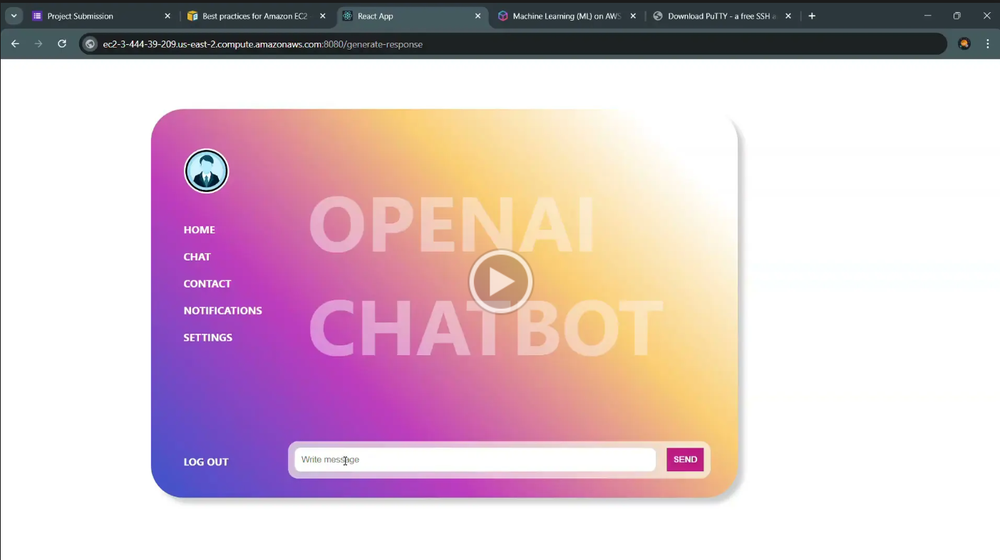

# AI_ChatBot
This project is an AI-powered chatbot that leverages Retrieval-Augmented Generation (RAG) to provide intelligent responses based on content from a provided PDF document. The system is built using ReactJS for the frontend, Flask for the backend API, LangChain for managing the language model pipeline, and the Ollama model (phi-3) for generating contextually relevant answers. The project is deployed on AWS Cloud using AWS EC2 instance.

##Features
- Contextual Responses: The chatbot provides responses that are contextually aware, using information retrieved from the given PDF.
- PDF-Based Knowledge: Load a PDF document in the RAG.ipynb file to customize the model, and the chatbot can answer questions based on the content within it.
- Real-time Interaction: Users can interact with the chatbot in real-time through a sleek ReactJS frontend.
- Backend Integration: The backend, built with Flask, handles requests from the frontend, processes them using LangChain, and interfaces with the Ollama model for generating responses.
- Deployed the chatbot on AWS EC2, leveraging cloud infrastructure to ensure high availability, scalability, and performance.
- Implemented RESTful APIs in Flask to handle user queries and responses efficiently, ensuring smooth communication between the front-end and back-end.


## Installation
- Clone the repository:
` git clone <repository-url>`
- Install dependencies:
``` pip install -r requirements.txt```
- Load PDF Document: Place your PDF files in the file_path variable in app.py. The application will process these PDFs for retrieval purposes.
- Start the Flask development server:```python main.py```
- Start the ReactJS server:```npm start```

Here's a video demonstration of our project:

[](https://drive.google.com/file/d/1xAR3q82C1a0LrHI2Vk0li-ReULnl4jVW/view?usp=sharing)
